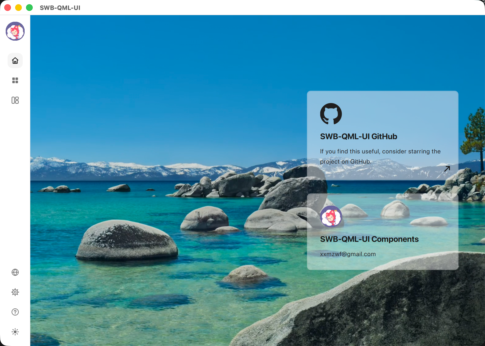
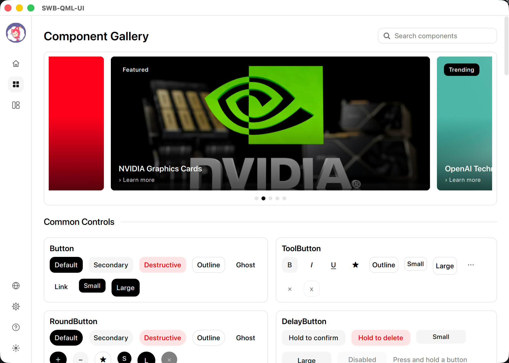
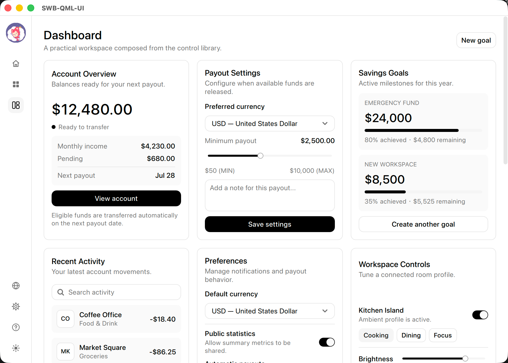
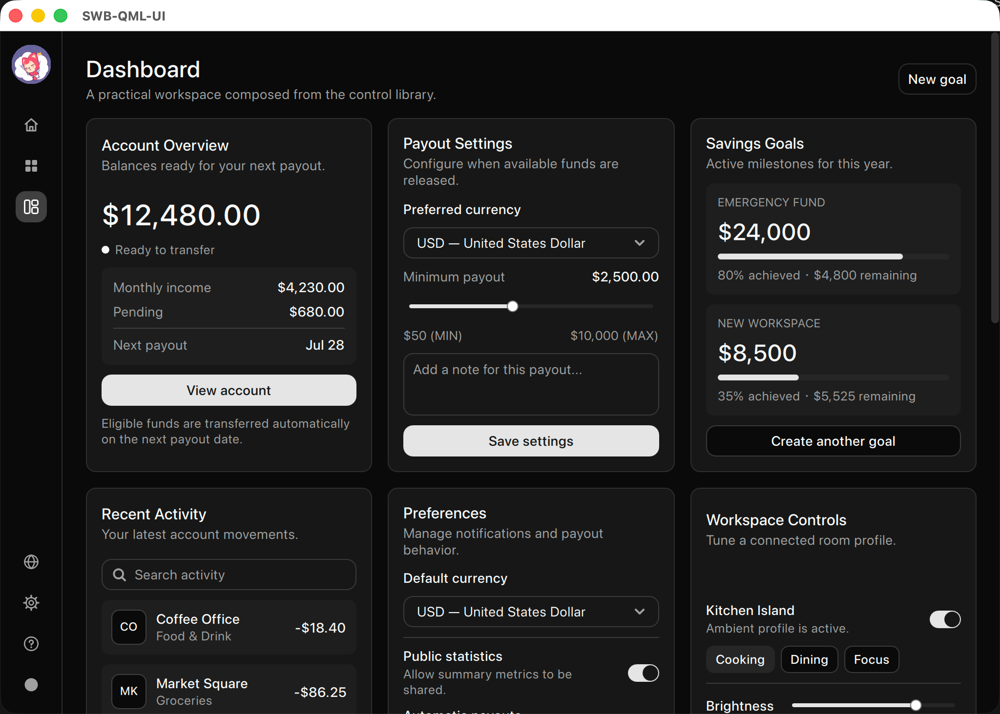

# SWB-QML-UI（Shadcn Base UI for QML）

[English](../README.md) | 简体中文

<p align="center">
  
  
</p>

**SWB-QML-UI 是一个 shadcn Base UI 风格的 QML GUI 控件库。** 它将 `QtQuick.Controls.Basic` 的全部可视化控件（共 51 个）重绘为简洁黑白的 shadcn Base UI 外观，并由单个单例驱动明暗主题切换。

出于对原作的尊重，特此声明：本库中一部分控件是基于 [shadcn](https://ui.shadcn.com/) Base UI 组件的设计参数实现的，其余控件为自行编写。

- **51 个重绘控件** —— 按钮、输入、菜单、弹层、导航、日历、表格辅助件……详见[控件参考](CONTROLS-Chinese.md)
- **一行代码换肤** —— 所有控件跟随 `SwbTheme` 单例，切换 `SwbTheme.darkMode` 即可整体切换明暗主题
- **零图片资源** —— 图标全部由 `Canvas` 运行时绘制，任意缩放不失真，且随主题变色
- **纯正 Qt** —— 基于 `QtQuick.Controls.Basic` 的纯 QML 实现，不依赖任何私有 API

## 截图展示

*首页*



*控件画廊*



| 浅色 | 深色 |
|---|---|
|  |  |

## 环境要求

- Qt **6.10 及以上**（开发与测试基于 Qt 6.11）
- CMake **3.21+**，支持 C++17 的编译器
- Ninja（推荐；其他 CMake 生成器亦可）

## 编译

```bash
git clone https://github.com/xxmzwf/SWB-QML-UI.git
cd SWB-QML-UI
cmake -S . -B build -G Ninja -DQT_PATH=/path/to/Qt/6.11.1/<platform>
cmake --build build
# 可选——仅在使用下方方式二/方式三的 find_package 集成时需要：
cmake --install build --prefix /path/to/installed
```

`QT_PATH` 指向你的 Qt 安装前缀（包含 `bin`、`lib`、`qml` 的那个目录）。不加任何参数时的默认行为：

| 选项 | 默认值 | 含义 |
|---|---|---|
| `CMAKE_BUILD_TYPE` | `Release` | Release 构建 |
| `BUILD_SHARED_LIBS` | `ON` | 将 SwbControls 编译为**动态库**（设为 `OFF` 则编译静态库） |
| `SWB_BUILD_EXAMPLES` | 顶层构建时为 `ON` | 编译示例程序（被 `add_subdirectory` 嵌入时自动关闭） |

运行示例（首页视频需要 `Qt6::Multimedia`）：

```bash
# macOS
./build/examples/SwbExample.app/Contents/MacOS/SwbExample
# Windows / Linux
./build/examples/SwbExample
```

## 导入到自己的项目

无论以哪种方式集成，QML 里的用法都是一样的：

```qml
import QtQuick
import SwbControls

Window {
    visible: true

    SwbButton {
        anchors.centerIn: parent
        text: "开始使用"
        variant: "outline"
    }
}
```

`SwbTheme` 是**模块单例**——它随模块自动注册，`import SwbControls` 之后即可在任何地方修改浅色/深色调色板和尺寸参数，或切换模式（`SwbTheme.darkMode = true`），深浅色默认跟随系统。每个可视控件还公开一个局部 `theme: SwbStyle` 对象，可单独覆盖当前实例的样式。完整 API 见[控件参考](CONTROLS-Chinese.md)。

> 下方 CMake 片段中的可执行目标名为 `appMyApp`。若你想换名字，请保证它**与你的 QML 模块 URI 不同名**（或将目标设为 macOS bundle），否则 QML 输出目录会和可执行文件抢占同一路径。

### 方式一.源码导入（`add_subdirectory`）

将本仓库拷贝（或以 git submodule 形式放置）到你的工程中，然后：

```cmake
add_subdirectory(SWB-QML-UI)

target_link_libraries(appMyApp PRIVATE Qt6::Quick SwbControls)
# 仅当你设置 BUILD_SHARED_LIBS=OFF 以静态方式编译时才需要：
if(NOT BUILD_SHARED_LIBS)
    target_link_libraries(appMyApp PRIVATE SwbControlsplugin)
endif()
```

就这么多——无需配置 import path。QML 文件被编译进库中，库加载时资源自动注册，`import SwbControls` 通过引擎内置的 `qrc:/qt/qml` 路径即可解析。此模式下示例程序会自动跳过编译。

### 方式二.动态库导入（`find_package`）

按默认选项编译后安装：

```bash
cmake --install build --prefix /your/prefix
```

安装产物布局：

```
lib/libSwbControls.<so|dylib|dll>     # 主库
lib/cmake/SwbControls/                # 供 find_package 使用的 CMake 包配置
share/qml/SwbControls/                # QML 模块：插件 + qmldir + qmltypes
```

在你的工程中使用：

```cmake
list(APPEND CMAKE_PREFIX_PATH "/your/prefix")
find_package(SwbControls REQUIRED)

target_link_libraries(appMyApp PRIVATE Qt6::Quick Swb::SwbControls)
# 包配置导出了 QML 模块的安装目录，把它传给你的应用：
target_compile_definitions(appMyApp PRIVATE
    SWB_QML_DIR="${SwbControls_QML_IMPORT_PATH}")
```

```cpp
QQmlApplicationEngine engine;
engine.addImportPath(QStringLiteral(SWB_QML_DIR));  // 在加载 QML 之前调用
```

**为什么需要 import path？** 动态库模式下，QML 引擎在运行时从磁盘加载插件，因此必须能找到 `share/qml/SwbControls/` 目录。把 `QML_IMPORT_PATH` 环境变量设为该目录同样可行。发布应用时，需要把 `libSwbControls` 和 `share/qml/SwbControls/` 目录随应用一起分发。

### 方式三.静态库导入（`find_package`）

编译并安装静态版本：

```bash
cmake -S . -B build-static -G Ninja -DBUILD_SHARED_LIBS=OFF -DQT_PATH=...
cmake --build build-static
cmake --install build-static --prefix /your/prefix
```

在你的工程中使用：

```cmake
list(APPEND CMAKE_PREFIX_PATH "/your/prefix")
find_package(SwbControls REQUIRED)
target_link_libraries(appMyApp PRIVATE Qt6::Quick Swb::SwbControls)
```

这就是静态与动态的区别所在：**不需要 import path，也不需要任何额外代码。** QML 插件、类型注册以及编译后的 QML 资源会直接链接进你的可执行文件（CMake 包配置已自动把它们挂到 `Swb::SwbControls` 上），引擎通过内置的 `qrc:/qt/qml` 路径即可找到模块，最终一切都打进单个二进制文件。

若想用同一份 CMakeLists.txt 兼容动态、静态两种安装，可按库类型有条件地定义 import path：

```cmake
get_target_property(_swb_type Swb::SwbControls TYPE)
if(_swb_type STREQUAL "SHARED_LIBRARY")
    target_compile_definitions(appMyApp PRIVATE
        SWB_QML_DIR="${SwbControls_QML_IMPORT_PATH}")
endif()
```

## 控件

`QtQuick.Controls.Basic` 的全部 51 个可视化控件均已覆盖——按钮、数值输入、文本编辑（含主题化右键菜单）、菜单、弹层、导航、容器、日历与表格辅助件。

**[→ 控件参考与用法](CONTROLS-Chinese.md)**

## 许可证

[MIT](../LICENSE)

## 致谢

- [shadcn/ui](https://ui.shadcn.com/) —— 本库遵循其 Base UI 组件的设计参数，感谢这套优秀的设计体系。
- [byralpha/AntDesign](https://github.com/byralpha/AntDesign) —— 示例程序中的部分资源文件取自该项目的 example，感谢这个出色的参考项目。
